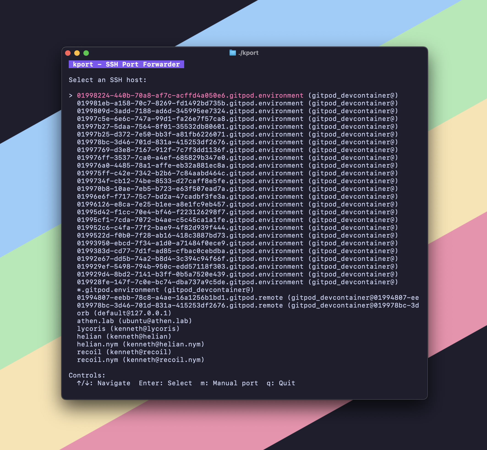

# kport - SSH Port Forwarder TUI

A terminal user interface (TUI) application for SSH port forwarding that reads from your local SSH config, allows you to select SSH connections, detects running ports on remote hosts, and forwards them to localhost.



*Interactive terminal interface for SSH port forwarding with host selection and port detection*

## Features

- **SSH Config Integration**: Automatically reads from `~/.ssh/config`
- **Include Support**: Supports SSH config `Include` directive with glob patterns
- **Full SSH Compatibility**: Uses native `ssh` command - supports ProxyCommand, jump hosts, and all SSH features
- **Interactive Host Selection**: Choose from configured SSH hosts using arrow keys
- **Automatic Port Detection**: Scans remote host for listening ports using `netstat`, `ss`, or `lsof`
- **Manual Port Forwarding**: Option to manually specify remote ports with improved UI
- **Smart Port Mapping**: Tries to use same port locally (e.g., remote:3000 → localhost:3000)
- **Real-time Port Forwarding**: Creates SSH tunnels using `ssh -L` command
- **Clean TUI Interface**: Built with Bubble Tea for a smooth terminal experience

## Installation

```bash
go build -o kport
```

## Usage

1. **Run the application**:
   ```bash
   ./kport
   ```

2. **Test port mapping** (optional):
   ```bash
   ./kport --test-port 3000
   # Shows: ✅ Port 3000 available locally - using same port
   #        Mapping: localhost:3000 -> remote:3000
   ```

3. **Select SSH Host**: Use arrow keys to navigate and press Enter to select an SSH host from your config

4. **Choose Port**: 
   - The app will automatically detect open ports on the remote host
   - Select a port to forward using arrow keys and Enter
   - Press 'm' for manual port entry

5. **Port Forwarding**: 
   - kport tries to use the same port locally (e.g., remote:3000 → localhost:3000)
   - If unavailable, it uses a random available port
   - Clear feedback shows the actual mapping and access URLs

## Controls

### Host Selection
- `↑/↓` or `j/k`: Navigate through SSH hosts
- `Enter`: Select host and detect ports
- `m`: Manual port forwarding for selected host
- `q`: Quit application

### Port Selection
- `↑/↓` or `j/k`: Navigate through detected ports
- `Enter`: Start port forwarding for selected port
- `m`: Switch to manual port entry
- `Esc`: Go back to host selection
- `q`: Quit application

### Manual Port Entry
- `0-9`: Enter port number
- `Backspace`: Delete last digit
- `Enter`: Start forwarding for entered port
- `Esc`: Go back to previous screen
- `q`: Quit application

### Active Forwarding
- `Esc`: Stop forwarding and return to host selection
- `q`: Quit application

## SSH Configuration

The application reads from your standard SSH config file at `~/.ssh/config`. Example configuration:

```
Host my-server
    HostName example.com
    User myuser
    Port 22
    IdentityFile ~/.ssh/id_rsa

Host dev-box
    HostName dev.example.com
    User developer
    Port 2222

# Include additional config files
Include ~/.ssh/config.d/*
Include ~/.ssh/work-config
```

### Include Support

kport supports the SSH `Include` directive, allowing you to organize your SSH configuration across multiple files:

- **Glob patterns**: `Include ~/.ssh/config.d/*`
- **Specific files**: `Include ~/.ssh/work-config`
- **Relative paths**: `Include config.d/servers`
- **Quoted paths**: `Include "gitpod/config"` or `Include 'path with spaces/config'`
- **Cycle detection**: Prevents infinite loops from circular includes

Relative paths in includes are resolved relative to `~/.ssh/` directory, matching OpenSSH behavior.

## Authentication

The application uses the native `ssh` command, so it supports all SSH authentication methods:
- SSH key-based authentication (using IdentityFile from config)
- SSH agent authentication (if SSH_AUTH_SOCK is set)
- ProxyCommand for jump hosts and SSH containers
- All other SSH configuration options (ControlMaster, etc.)

This means if you can connect with `ssh hostname`, kport will work too!

## Requirements

- Go 1.19 or later
- SSH access to remote hosts
- SSH config file at `~/.ssh/config`

## Dependencies

- `github.com/charmbracelet/bubbletea` - TUI framework
- `github.com/charmbracelet/lipgloss` - Terminal styling
- `golang.org/x/crypto/ssh` - SSH client implementation
- `golang.org/x/crypto/ssh/agent` - SSH agent support

## How It Works

1. **Config Parsing**: Reads and parses your SSH config file to extract host information
2. **SSH Connection**: Uses native `ssh` command with all your configured options
3. **Port Detection**: Runs commands like `netstat -tlnp` on the remote host via SSH to find listening ports
4. **Port Forwarding**: Uses `ssh -L localport:localhost:remoteport hostname` for tunneling
5. **Full Compatibility**: Works with ProxyCommand, jump hosts, SSH containers, and all SSH features

## Expected Behavior

When you select an SSH host:

1. **Connection Success**: Shows detected ports or "No ports detected" with option for manual entry
2. **Connection Failure**: Shows "Could not connect" message with option for manual port forwarding
3. **Timeout**: Connection attempts timeout after 5 seconds to avoid hanging

The application gracefully handles connection failures and allows you to:
- Go back to host selection with `Esc`
- Try manual port forwarding with `m`
- Quit with `q`

## Limitations

- Requires `ssh` command to be available in PATH
- Port detection requires `netstat`, `ss`, or `lsof` on the remote host
- Connection failures are expected for non-existent or unreachable hosts

## Advantages of Using Native SSH Command

- **Full SSH Feature Support**: ProxyCommand, ControlMaster, jump hosts, etc.
- **Consistent Behavior**: Same authentication and connection logic as your terminal
- **SSH Container Support**: Works with containers that require ProxyCommand
- **No Additional Setup**: If `ssh hostname` works, kport works too

## License

MIT License